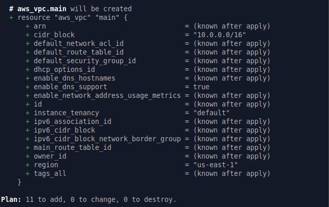
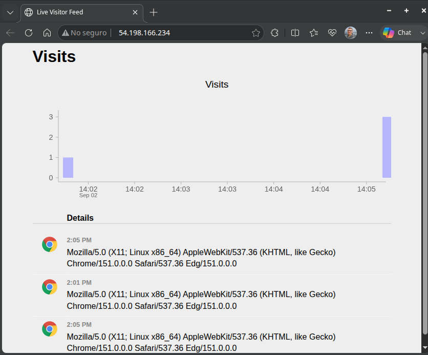
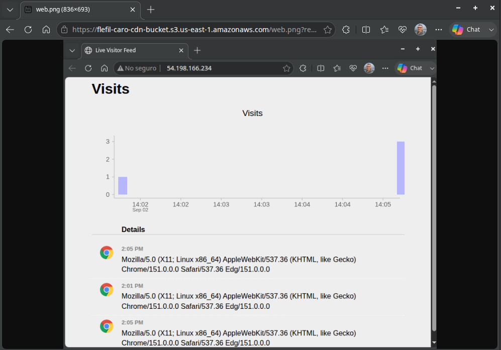
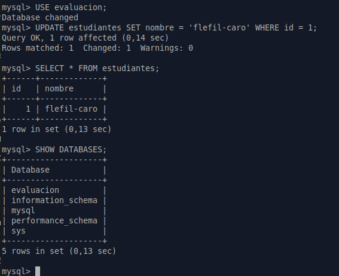
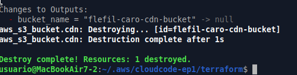
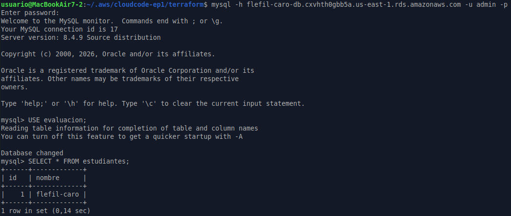
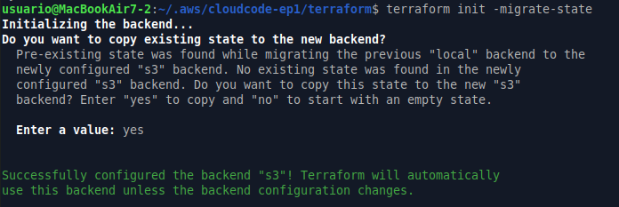
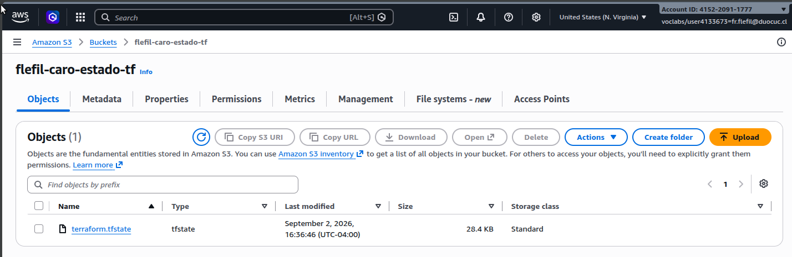

# Evaluación Parcial 1: Infraestructura como Código I (AUY1103)

**Estudiantes:** Francisco Flefil / Javier Caro (Dupla: `flefil-caro`)
**Asignatura:** Infraestructura como código I

---

## Descripción del Proyecto
Este proyecto implementa una infraestructura base en AWS utilizando Terraform. La arquitectura contempla la creación de una VPC, un servidor web de presentación (EC2), un CDN para almacenamiento de imágenes (S3 con acceso público) y una base de datos relacional (RDS MySQL), cumpliendo con los estándares de Infraestructura como Código (IaC).

---

## Etapa 1 y 2: Implementación y Validación de Recursos

A continuación, se presenta la evidencia de la creación y correcto funcionamiento de los recursos solicitados:

### 1. Plan de Ejecución de Terraform
Evidencia del despliegue inicial de la infraestructura de red, cómputo y almacenamiento.

### 2. Servidor Web (EC2)
Validación del acceso a través de internet al servidor web Apache configurado.

### 3. Almacenamiento CDN (Bucket S3)
Comprobación del acceso público a los archivos alojados en el bucket S3 para la carga de imágenes.

### 4. Base de Datos (RDS MySQL)
Verificación del acceso a la base de datos y la correcta creación de registros utilizando el identificador de la dupla (`flefil-caro`).

---

## Etapa 4: Persistencia de Datos (Ciclo de Vida)

Para asegurar la persistencia de la información ante una eventual destrucción del entorno, se configuró la base de datos con políticas de retención de snapshots (`skip_final_snapshot = false`).

### 1. Destrucción de la Infraestructura
Ejecución del comando `terraform destroy`, demostrando el desmantelamiento de los recursos y la creación automática del snapshot final de seguridad.

### 2. Restauración de los Datos
Despliegue de la infraestructura inyectando el snapshot previo. Se comprueba que el registro original de la dupla sobrevive a la destrucción de la infraestructura.

---

## Configuración del Backend Remoto (Gestión del Estado)

Para garantizar la integridad, consistencia y trabajo colaborativo, el estado de Terraform (`terraform.tfstate`) fue migrado desde el entorno local hacia un Backend remoto seguro en AWS S3.

### 1. Migración del Estado (Terminal)
Inicialización del backend y migración exitosa confirmada por la consola.

### 2. Persistencia en la Nube (AWS S3)
Verificación del archivo de estado correctamente registrado y alojado en el bucket S3 de AWS.

